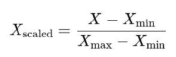
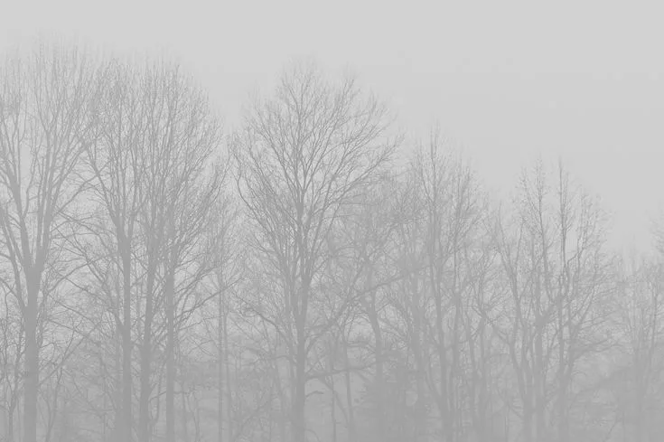

# README для проекта нормирования MinMax

## 1. Теоретическая база

Нормирование MinMax — это метод предобработки данных, который преобразует значения в заданный диапазон, чаще всего от 0 до 1 или от 0 до 255. Этот метод особенно полезен в задачах машинного обучения и обработки изображений, так как он способствует улучшению качества данных и их сходимости в алгоритмах.

### Преимущества нормирования:
- Улучшение качества данных: Нормированные данные легче анализировать и визуализировать.
- Скорость обучения: Алгоритмы машинного обучения быстрее сходятся на нормированных данных.
- Устойчивость к выбросам: Уменьшается влияние крайних значений на общую модель.

Основная формула для нормирования:

где:
-  X  — оригинальное значение,
-  X_{min}  — минимальное значение в наборе данных,
-  X_{max}  — максимальное значение в наборе данных.

## 2. Описание разработанной системы

### Алгоритмы и принципы работы

Система реализует два метода нормирования изображений с использованием MinMax: 

1. Метод с использованием OpenCV:
   - Загружает изображение с помощью OpenCV.
   - Применяет встроенную функцию нормирования cv2.normalize.
   - Сохраняет нормализованное изображение.
  
2. Метод с использованием NumPy:
   - Загружает изображение с помощью Pillow.
   - Преобразует изображение в градации серого (если цветное).
   - Нормирует значения пикселей вручную, используя формулу MinMax.
   - Сохраняет нормализованное изображение. 

### Архитектура

- Пакеты: Используются библиотеки NumPy, Pillow и OpenCV для обработки изображений.
- Структура проекта:

## 3. Результаты работы и тестирования системы

### Примеры нормализованных изображений

1. Исходное изображение:
   
 

2. Нормализованное изображение (OpenCV):
   
 

3. Нормализованное изображение (NumPy):
   
 

### Время выполнения

- Время выполнения нормирования (OpenCV): 0.05604124069213867 секунд.
- Время выполнения нормирования (NumPy): 3.169410467147827 секунд.

### Сравнение результатов

| Метод          | Время выполнения | Размер изображения   |
|----------------|------------------|--------------------- |
| OpenCV         | 0.0560412 секунд | 188 КБ               |
| NumPy          | 3.1694104 секунд | 163 КБ               |

Метод OpenCV работает быстрее.

### Закономерности

Нормирование изображений позволяет значительно улучшить контраст и четкость визуальной информации. Это полезно в приложениях компьютерного зрения, таких как:
- Распознавание лиц: Улучшение четкости изображения помогает в более точном распознавании лиц.
- Медицинская диагностика: Ясные изображения помогают врачам быстрее и точнее диагностировать заболевания.

## 4. Выводы

Разработанная система эффективно нормирует изображения с использованием двух методов: NumPy и OpenCV. Оба метода позволяют повысить контрастность изображения. При этом метод OpenCV демонстрирует лучшую производительность, что делает его предпочтительным выбором для больших наборов данных и в реальном времени.

## 5. Использованные источники

- [Normalization в Машинном обучении простыми словами](https://dzen.ru/a/YAnEI28foWXB5_wX)
- [Pillow обработка изображений в Python на примерах](https://python-scripts.com/pillow)
- [OpenCV в Python. Часть 1](https://habr.com/ru/articles/519454/)
- [Методы нормализации данных](https://en.wikipedia.org/wiki/Feature_scaling)
